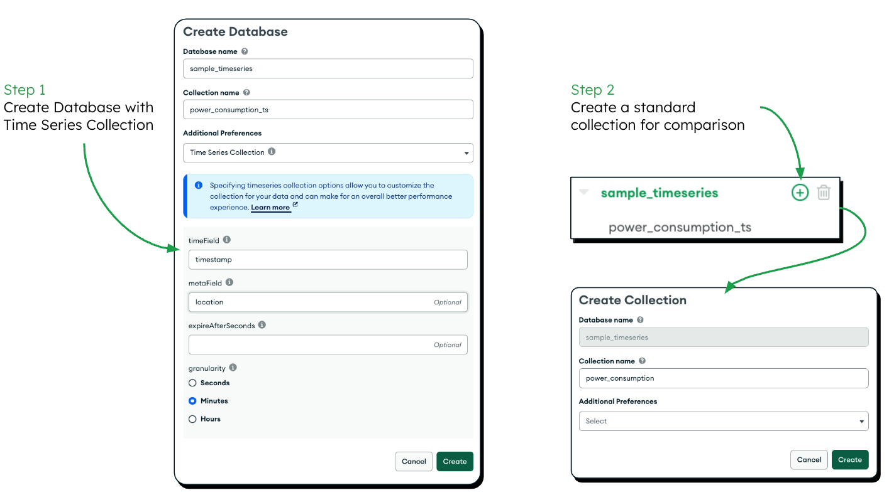
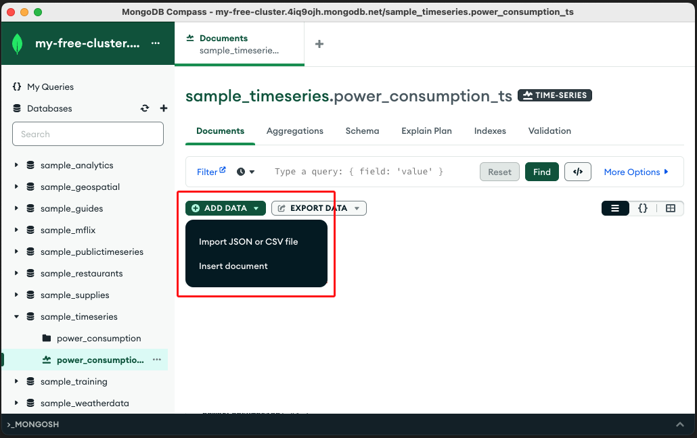
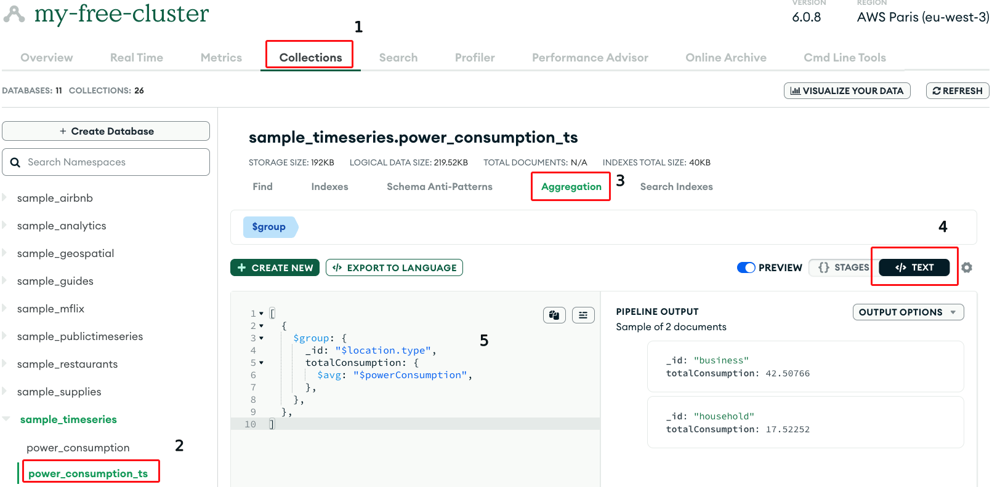
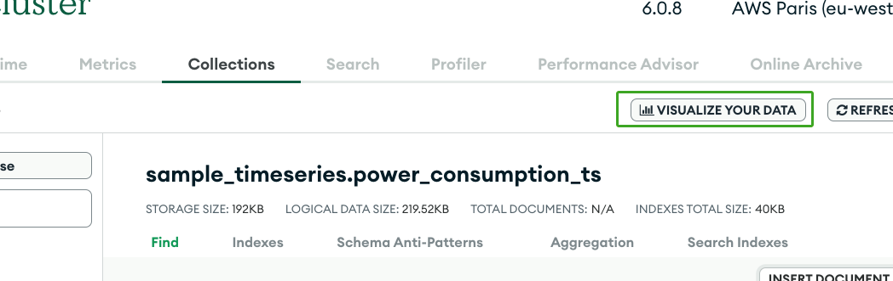
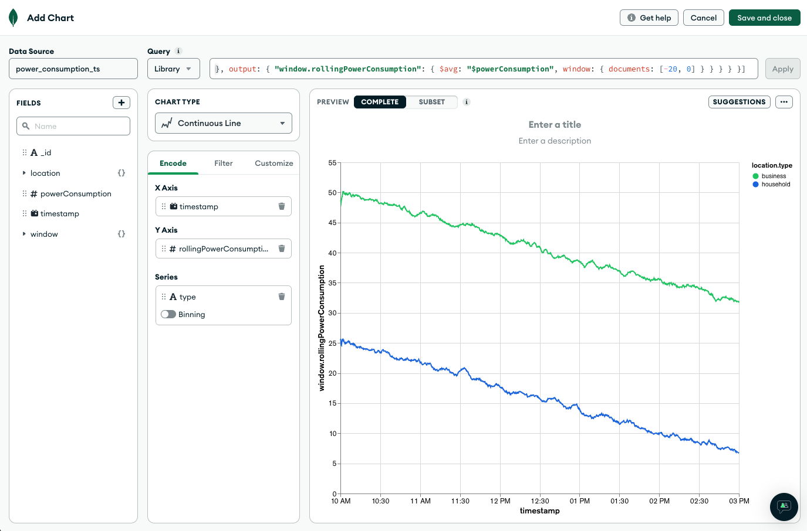

MongoDB Time-series collections are a specialized feature designed to handle time-series data efficiently, making it ideal for applications in industries like Power & Utilities, where data is collected and recorded over time. Time-series collections in MongoDB store data in a format optimized for time-based queries, ensuring fast and flexible access to historical data.

Below, I'll explain how you can use MongoDB Time-series collections in the context of the Power & Utilities industry with an example scenario:

**Example Scenario: Monitoring Power Consumption**

Let's imagine you are developing a system to monitor power consumption for a city's utility grid. The goal is to collect and store real-time power usage data from various sources, such as smart meters installed in homes, businesses, and public facilities. The system should allow users to analyze historical power consumption trends and make informed decisions regarding energy distribution and optimization.

# Step 1: Set up the MongoDB Atlas Cluster

First, you need to set up a Atlas Cluster. You can create an account in Atlas and set-up a free cluster following these steps:

1. Visit: https://www.mongodb.com/cloud/atlas
2. Click "Try Free" and follow the prompts.
3. Confirm your Email.
4. And in the initial survey, you can answer "Learn MongoDB" and "I'm just exploring".
5. Choose the "M0 Free" option for our hands-on exercises.

# Step 2: Create a Time-series Collection

Next, create a Time-series collection specifically tailored for power consumption data. When creating the collection, define the time field and any additional metadata you want to associate with each data point.



(You can also do this programmatically)

```js
use power_utilities_db;

db.createCollection("power_consumption_ts", {
  timeseries: {
    timeField: "timestamp",
    metaField: "location",
    granularity: "minutes"
  }
});
```

In this example, we've created a collection named `power_consumption_ts`. The timeField is set to "timestamp," which represents the time when each data point is recorded. We've also included a metaField called "location," which allows us to associate each data point with a specific meter or location.

# Step 3: Insert Data into the Time-series Collection

Now, let's insert some sample power consumption data into the Time-series collection. For simplicity, we'll assume the data comes from three different types and from different regions.

import `power_consumption.json` into `power_consumption_ts` using [MongoDB Compass](https://www.mongodb.com/products/compass).



For reference, the structure of the documents being imported are the following:

```js
{
  "_id": ObjectId("5efd88fc4f144015cea85732"),
  "timestamp": Date("2023-07-19T00:00:17.280Z"),
  "location": {
    "region": "madrid",
    "type": "household" // or "business", or "public"
  },
  "powerConsumption": "15.1"
}
```

# Step 4: Querying Time-series Data

Now that you have data in the Time-series collection, you can perform various time-based queries to analyze the power consumption trends over time.

For example, you can select just a range

```js
{
  timestamp: {
    $gte: { $date: "2023-07-19T10:00:00Z" },
    $lte: { $date: "2023-07-19T15:00:00Z" }
  }
}
```

For example, you can retrieve the average power consumption of a specific type:



```js
[
  {
    $match: { "location.type": "household" }
  },
  {
    $group: {
      _id: null,
      totalConsumption: { $avg: "$powerConsumption" }
    }
  }
]
```

For example, you can retrieve the average power consumption per type:

```js
[
  {
    $group: {
      _id: "$location.type",
      totalConsumption: {
        $avg: "$powerConsumption",
      },
    },
  },
]
```

# Step 5: Data Visualization

Time series data is perfectly well suited for data visualization. It's possible to use Atlas SQL to query it using, for example, Tableau and other data visualization tools.

In this example we'll use Atlas Charts since its a tool that is already available in Atlas.



```js
[
  {
    $match: {
      timestamp: {
        $gte: { $date: "2023-07-19T10:00:00Z" },
        $lte: { $date: "2023-07-19T15:00:00Z" }
      }
    }
  }
]
```

Info ⬆️: This allow us to see the measurements between 10:00 and 15:00. But it may not be very readable.

We can use the `$setWindowFields` to render the chart more readable.

```js
[
  {
    $match: {
      timestamp: {
        $gte: { $date: "2023-07-19T10:00:00Z" },
        $lte: { $date: "2023-07-19T15:00:00Z" }
      }
    }
  },
  {
    $setWindowFields: {
      partitionBy: "$location",
      sortBy: { timestamp: 1 },
      output: {
        "window.rollingPowerConsumption": {
          $avg: "$powerConsumption",
          window: {
            documents: [-20, 0]
          }
        }
      }
    }
  }
]
```



Info ⬆️: The first step applies the $avg window function to the `powerConsumption` value. The data is partitioned by `$location` because the different locations are discrete series, and should be averaged separately. I've chosen to create a window over 20 documents at a time.

```js
[
  {
    $match: {
      timestamp: {
        $gte: { $date: "2023-07-19T10:00:00Z" },
        $lte: { $date: "2023-07-19T15:00:00Z" }
      }
    }
  },
  {
    $setWindowFields: {
      partitionBy: "$location",
      sortBy: { timestamp: 1 },
      output: {
        "window.rollingPowerConsumption": {
          $avg: "$powerConsumption",
          window: {
            range: [-1, 0],
            unit: 'hour'
          }
        }
      }
    }
  }
]
```

Info ⬆️: By adding `window.unit` and changing "documents:" to `range` we can run an window with a time duration.

```js
[
  {
    $bucketAuto: {
      groupBy: "$timestamp",
      buckets: 24,
      output: {
        "avgPowerConsumption": { $avg: "$powerConsumption" },
        timestamp: { $min: "$timestamp" },
        location: { $first: "$location" }
      }
    }
  }
]
```

Info ⬆️: We can bucket the averages to reduce the resolution of our results.

-----------------

# Step 6: Transform the Data

```js
[
  {
    $bucketAuto: {
      groupBy: "$timestamp",
      buckets: 24,
      output: {
        "avgPowerConsumption": { $avg: "$powerConsumption" },
        timestamp: { $min: "$timestamp" },
        location: { $first: "$location" }
      }
    }
  },
  {
    $merge: {
        into: "power_consumption_lowres",
        whenMatched: "replace"
    }
  }
]
```

Info ⬆️: Store a low-res result of the aggregation into another collection called `power_consumption_lowres`

# Step 7: Data Retention Policies

In the Power & Utilities industry, it's common to have data retention policies where historical data beyond a certain period is no longer needed for real-time analysis. MongoDB Time-series collections provide features to handle data retention automatically.

It is possible to set up your Time-series collection with `expireAfterSeconds` to automatically delete documents older than a specific period:

```js
db.createCollection("power_consumption_ts", {
  timeseries: {
    timeField: "timestamp",
    metaField: "location",
    granularity: "minutes",
    expireAfterSeconds: 2592000
  }
});
```

Info ⬆️: In this case, the documents in the `power_consumption_ts` collection will automatically expire and be deleted after 30 days (2592000 seconds) based on the timestamp field.

Using MongoDB Time-series collections in the Power & Utilities industry enables efficient storage, retrieval, and analysis of time-based data, empowering businesses to make data-driven decisions for energy management and optimization.
